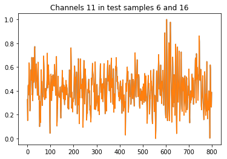
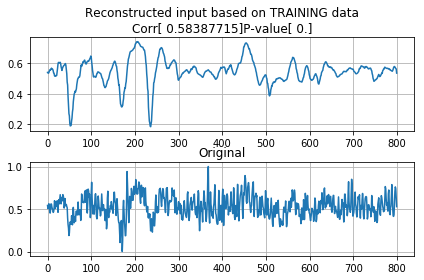
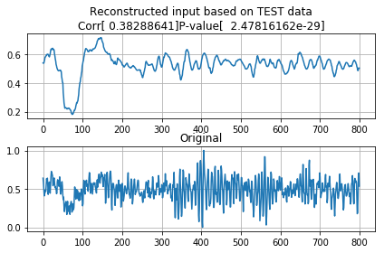

```python
# make sure you don't hog all the video memory
import tensorflow as tf
config = tf.ConfigProto()
config.gpu_options.allow_growth = True
sess = tf.Session(config=config)
from keras import backend as K
K.set_session(sess)
###################################

# we first define the autoencoder's architecture:

from keras.layers import Input, Dense, Conv2D, MaxPooling2D, UpSampling2D
from keras.models import Model
from keras import backend as K
from keras.models import load_model
from keras.callbacks import TensorBoard
import numpy as np
import matplotlib.pyplot as plt

def Encoder():
    input_img = Input(shape=(60, 800, 1))  # adapt this if using `channels_first` image data format   
    e1 = Conv2D(16, (3, 3), activation='relu', padding='same')(input_img)
    e2 = MaxPooling2D((2, 2), padding='same')(e1)
    e3 = Conv2D(8, (3, 3), activation='relu', padding='same')(e2)
    e4 = MaxPooling2D((3, 2), padding='same')(e3)
    e5 = Conv2D(8, (10, 10), activation='relu', padding='same')(e4)
    e6 = MaxPooling2D((2, 2), padding='same')(e5)
    return Model(input_img, e6)

def Decoder():
    input_img = Input(shape=(5, 100, 8))  # adapt this if using `channels_first` image data format   
    d1 = Conv2D(8, (10, 10), activation='relu', padding='same')(input_img)
    d2 = UpSampling2D((2, 2))(d1)
    d3 = Conv2D(8, (3, 3), activation='relu', padding='same')(d2)
    d4 = UpSampling2D((3, 2))(d3)
    d5 = Conv2D(16, (3, 3), activation='relu', padding='same')(d4)
    d6 = UpSampling2D((2, 2))(d5)
    d7 = Conv2D(1, (3, 3), activation='sigmoid', padding='same')(d6)
    return Model(input_img, d7)
```

    Using TensorFlow backend.


```python
# define input to the model:
x = Input(shape=(60, 800, 1))

# make the encoder:
enc = Model(x, Encoder()(x))
enc.compile(optimizer='adadelta', loss='binary_crossentropy')

# make the model:
autoencoder = Model(x, Decoder()(enc(x)))

# compile the model:
autoencoder.compile(optimizer='adadelta', loss='binary_crossentropy')
```


```python
# SEE INSIDE THE ENCODER AND DECODER:
Encoder().summary()
Decoder().summary()

# IN FACT, OUT AUTOENCODER WILL BE A CONCATENATION OF TWO MODELS
autoencoder.summary()
```

    _________________________________________________________________
    Layer (type)                 Output Shape              Param #   
    =================================================================
    input_4 (InputLayer)         (None, 60, 800, 1)        0         
    _________________________________________________________________
    conv2d_8 (Conv2D)            (None, 60, 800, 16)       160       
    _________________________________________________________________
    max_pooling2d_4 (MaxPooling2 (None, 30, 400, 16)       0         
    _________________________________________________________________
    conv2d_9 (Conv2D)            (None, 30, 400, 8)        1160      
    _________________________________________________________________
    max_pooling2d_5 (MaxPooling2 (None, 10, 200, 8)        0         
    _________________________________________________________________
    conv2d_10 (Conv2D)           (None, 10, 200, 8)        6408      
    _________________________________________________________________
    max_pooling2d_6 (MaxPooling2 (None, 5, 100, 8)         0         
    =================================================================
    Total params: 7,728
    Trainable params: 7,728
    Non-trainable params: 0
    _________________________________________________________________
    _________________________________________________________________
    Layer (type)                 Output Shape              Param #   
    =================================================================
    input_5 (InputLayer)         (None, 5, 100, 8)         0         
    _________________________________________________________________
    conv2d_11 (Conv2D)           (None, 5, 100, 8)         6408      
    _________________________________________________________________
    up_sampling2d_4 (UpSampling2 (None, 10, 200, 8)        0         
    _________________________________________________________________
    conv2d_12 (Conv2D)           (None, 10, 200, 8)        584       
    _________________________________________________________________
    up_sampling2d_5 (UpSampling2 (None, 30, 400, 8)        0         
    _________________________________________________________________
    conv2d_13 (Conv2D)           (None, 30, 400, 16)       1168      
    _________________________________________________________________
    up_sampling2d_6 (UpSampling2 (None, 60, 800, 16)       0         
    _________________________________________________________________
    conv2d_14 (Conv2D)           (None, 60, 800, 1)        145       
    =================================================================
    Total params: 8,305
    Trainable params: 8,305
    Non-trainable params: 0
    _________________________________________________________________
    _________________________________________________________________
    Layer (type)                 Output Shape              Param #   
    =================================================================
    input_1 (InputLayer)         (None, 60, 800, 1)        0         
    _________________________________________________________________
    model_2 (Model)              (None, 5, 100, 8)         7728      
    _________________________________________________________________
    model_3 (Model)              (None, 60, 800, 1)        8305      
    =================================================================
    Total params: 16,033
    Trainable params: 16,033
    Non-trainable params: 0
    _________________________________________________________________


```python
# get the Dataset:

import numpy as np
from sklearn.model_selection import train_test_split
from sklearn import preprocessing
import scipy.io as sio

# load data from the .mat file:
mat_contents = sio.loadmat('EEG_bigplt.plot(range(0, 800), x_test[15,10,:,0], range(0, 800), x_test[15,10,:,0])
.mat') # or ('EEG_data.mat')
X = mat_contents['X']
Y = mat_contents['Y']
x_train, x_test, y_train, y_test = train_test_split(X, Y, test_size=0.30)
print('Original data type:', x_train.dtype)

# convert to float64 for numerical stability:
x_train = x_train.astype('float64')
y_train = y_train.astype('float64')
x_test = x_test.astype('float64')
y_test = y_test.astype('float64')

# normalize to unit variance and zero mean:
for i in range(x_train.shape[0]):
    x_train[i,:,:] = preprocessing.scale(x_train[i,:,:], axis=1)
    x_train[i,:,:] = preprocessing.minmax_scale(x_train[i,:,:], axis=1)
    y_train[i,:] = preprocessing.scale(y_train[i,:], axis=0)
    y_train[i,:] = preprocessing.minmax_scale(y_train[i,:], axis=0)

for i in range(x_test.shape[0]):
    x_test[i,:,:] = preprocessing.scale(x_test[i,:,:], axis=1)
    x_test[i,:,:] = preprocessing.minmax_scale(x_test[i,:,:], axis=1)
    y_test[i,:] = preprocessing.scale(y_test[i,:], axis=0)
    y_test[i,:] = preprocessing.minmax_scale(y_test[i,:], axis=0)

# ensure the tensors are sized right:
x_train = np.expand_dims(x_train,3)
x_test = np.expand_dims(x_test,3)
y_test = np.expand_dims(y_test,1)
y_test = y_test[:,:,:,None]
y_train = np.expand_dims(y_train,1)
y_train = y_train[:,:,:,None]

# convert to float16 to save space:
x_train = x_train.astype('float16')
y_train = y_train.astype('float16')
x_test = x_test.astype('float16')
y_test = y_test.astype('float16')
print('Normalized data type:', x_train.dtype)

print('test input shape', x_test.shape, "Nomralized MEAN:", np.mean(x_test), "min", np.min(x_test),"max", np.max(x_test))
print('train input shape', x_train.shape, "Nomralized MEAN:", np.mean(x_train), "min", np.min(x_train),"max", np.max(x_train))

print('test labels shape', y_test.shape, "Nomralized MEAN:", np.mean(y_test), "min", np.min(y_test),"max", np.max(y_test))
print('train labels shape', y_train.shape, "Nomralized MEAN:", np.mean(y_train), "min", np.min(y_train),"max", np.max(y_train))
```

    Original data type: float32
    Normalized data type: float16
    test input shape (81, 60, 800, 1) Nomralized MEAN: 0.51855 min 0.0 max 1.0
    train input shape (189, 60, 800, 1) Nomralized MEAN: 0.51514 min 0.0 max 1.0
    test labels shape (81, 1, 800, 1) Nomralized MEAN: 0.50391 min 0.0 max 1.0
    train labels shape (189, 1, 800, 1) Nomralized MEAN: 0.50146 min 0.0 max 1.0


```python
# inspect channel 11
%matplotlib inline
plt.plot(range(0, 800), x_test[15,10,:,0], range(0, 800), x_test[15,10,:,0])
ax = plt.gca()
ax.set_title("Channels 11 in test samples 6 and 16")
```


    Text(0.5,1,'Channels 11 in test samples 6 and 16')





```python
# Training time!

autoencoder.fit(x_train, x_train,
                epochs=2,
                batch_size=40,
                shuffle=True,
                validation_data=(x_test, x_test),
                callbacks=[TensorBoard(log_dir='/home/amplifier/home/logs/EEG_CNN_autoencoder')])

# save the entire model and the weights after the training:
autoencoder.save('/home/amplifier/home/models/CNN_autoencoder.h5')
autoencoder.save_weights('/home/amplifier/home/weights/CNN_autoencoder_weights.h5')
enc.save('/home/amplifier/home/models/CNN_encoder_model.h5')
```

    Train on 189 samples, validate on 81 samples
    Epoch 1/2
    189/189 [==============================] - 1s 3ms/step - loss: 0.6659 - val_loss: 0.6620
    Epoch 2/2
    189/189 [==============================] - 0s 3ms/step - loss: 0.6658 - val_loss: 0.6616


```python
# let's predict a TRAINING sammple:
decoded_train = autoencoder.predict(x_train)
decoded_test = autoencoder.predict(x_test)
print(decoded_train.shape)
print(decoded_test.shape)
```

    (189, 60, 800, 1)
    (81, 60, 800, 1)


```python
reconstruct_training_sample = True
chan = 45
samp = 3

from scipy.stats import pearsonr
# now let's see how the model performs:

if (reconstruct_training_sample==True):
    reconst = decoded_train[samp,chan,:,:].reshape(800,1)
    orig = x_train[samp,chan,:,:].reshape(800,1)
    R,p = pearsonr(reconst, orig)
    title = "Reconstructed input based on TRAINING data" + "\n" + "Corr" + str(R) + "P-value" + str(p)
else:
    reconst = decoded_test[samp,chan,:,:].reshape(800,1)
    orig = x_test[samp,chan,:,:].reshape(800,1)
    R,p = pearsonr(reconst, orig)
    title = "Reconstructed input based on TEST data" + "\n" + "Corr" + str(R) + "P-value" + str(p)


print("Pearson's R:", R, "p-value", p)
%matplotlib inline
plt.subplot(211)
plt.plot(reconst)
ax = plt.gca()
ax.set_title(title)
ax.grid()
plt.subplot(212)
plt.plot(orig)
ax = plt.gca()
plt.tight_layout()
ax.set_title("Original")
ax.grid()
```

    Pearson's R: [ 0.58387715] p-value [ 0.]





```python
reconstruct_training_sample = False
chan = 45
samp = 30

from scipy.stats import pearsonr
# now let's see how the model performs:

if (reconstruct_training_sample==True):
    reconst = decoded_train[samp,chan,:,:].reshape(800,1)
    orig = x_train[samp,chan,:,:].reshape(800,1)
    R,p = pearsonr(reconst, orig)
    title = "Reconstructed input based on TRAINING data" + "\n" + "Corr" + str(R) + "P-value" + str(p)
else:
    reconst = decoded_test[samp,chan,:,:].reshape(800,1)
    orig = x_test[samp,chan,:,:].reshape(800,1)
    R,p = pearsonr(reconst, orig)
    title = "Reconstructed input based on TEST data" + "\n" + "Corr" + str(R) + "P-value" + str(p)


print("Pearson's R:", R, "p-value", p)
%matplotlib inline
plt.subplot(211)
plt.plot(reconst)
ax = plt.gca()
ax.set_title(title)
ax.grid()
plt.subplot(212)
plt.plot(orig)
ax = plt.gca()
plt.tight_layout()
ax.set_title("Original")
ax.grid()
```

    Pearson's R: [ 0.38288641] p-value [  2.47816162e-29]




