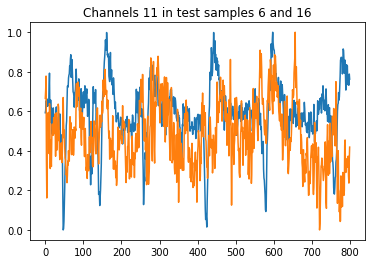
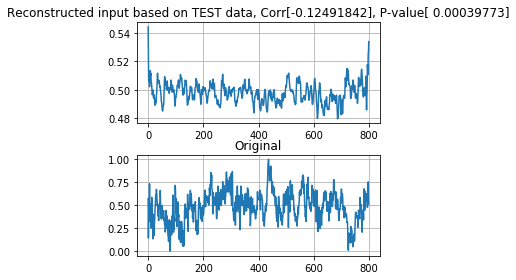
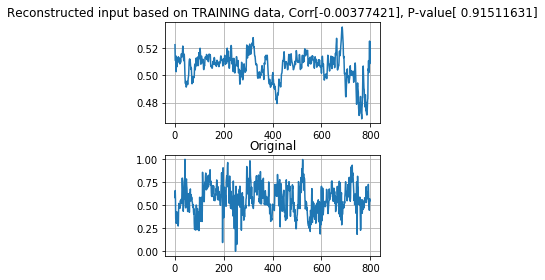

## This is an implementation of a convnet that *tries* to reconstruct attended audio from EEG signal. 

This version is built from an encoder (trained in another notebook called EEGnet_CNN_autoencoder) that is supposed to *know* dense representations of the EEG features. Here we add this pre-trained encoder, freeze its weights and try to learn to reconstruct the audio based on the dense hidden representations of the EEG signal. So far, (at lease in its current form, the net fails to achieve any reconstruction at all. We get overfitting, that's it. ANY SUGGESTIONS ARE VERY WELCOME!


```python
# we first define the autoencoder's architecture:

# make sure you don't hog all the video memory
import tensorflow as tf
config = tf.ConfigProto()
config.gpu_options.allow_growth = True
sess = tf.Session(config=config)
from keras import backend as K
K.set_session(sess)
###################################

from keras.layers import Input, Dense, Conv2D, MaxPooling2D, UpSampling2D, Dropout, BatchNormalization
from keras.layers.advanced_activations import LeakyReLU
from keras.models import Model
from keras.models import load_model
from keras.callbacks import TensorBoard

import numpy as np
import matplotlib.pyplot as plt

# def Encoder():
#     input_img = Input(shape=(60, 800, 1))  # adapt this if using `channels_first` image data format   
#     e1 = Conv2D(16, (3, 3), activation='relu', padding='same')(input_img)
#     e2 = MaxPooling2D((2, 2), padding='same')(e1)
#     e3 = Conv2D(8, (3, 3), activation='relu', padding='same')(e2)
#     e4 = MaxPooling2D((3, 2), padding='same')(e3)
#     e5 = Conv2D(8, (10, 10), activation='relu', padding='same')(e4)
#     e6 = MaxPooling2D((2, 2), padding='same')(e5)
#     return Model(input_img, e6)

def Decoder():
    input_img = Input(shape=(5, 100, 8))  # adapt this if using `channels_first` image data format   
    d1 = Conv2D(8, (10, 10), activation='relu', padding='same')(input_img)
    d2 = UpSampling2D((1, 2))(d1)
    d3 = BatchNormalization(axis=1)(d2)
    d4 = Dropout(0.20)(d3)
    d5 = Conv2D(8, (5, 5), activation='relu', padding='same')(d4)
    d6 = UpSampling2D((1, 2))(d5)
    d7 = BatchNormalization(axis=1)(d6)
    d8 = Dropout(0.05)(d7)
    d9 = Conv2D(8, (4, 4), activation='relu', padding='same')(d8)
    d10 = UpSampling2D((1, 2))(d9)
    d11 = BatchNormalization(axis=1)(d10)
    d12 = Dropout(0.15)(d11)
    d13 = Conv2D(8, (3, 3), activation='linear', padding='same')(d12)     # !!!!!!!!!!!!!!!!relu
    d13a = LeakyReLU(alpha=0.001)(d13)
    d14 = MaxPooling2D((5, 1))(d13a)
    d15 = Conv2D(1, (3, 3), activation='sigmoid', padding='same')(d14)  # !!!!!!!!!!!!!!!!relu
    return Model(input_img, d15)

```


```python
# define input to the model:
x = Input(shape=(60, 800, 1))

# load the pre-trained encoder
enc = load_model("/home/amplifier/home/models/CNN_encoder_model.h5")
enc.trainable = False ############################################################################!!!!!!!!!!!!!!!!!@@@
enc.compile(optimizer='adadelta', loss='binary_crossentropy')

# make the model:
model = Model(x, Decoder()(enc(x)))

# compile the model:
model.compile(optimizer='adadelta', loss='binary_crossentropy')
```


```python
# SEE INSIDE THE ENCODER AND DECODER:

enc.summary()
Decoder().summary()
model.summary()
```

    _________________________________________________________________
    Layer (type)                 Output Shape              Param #   
    =================================================================
    input_1 (InputLayer)         (None, 60, 800, 1)        0         
    _________________________________________________________________
    model_1 (Model)              (None, 5, 100, 8)         7728      
    =================================================================
    Total params: 7,728
    Trainable params: 0
    Non-trainable params: 7,728
    _________________________________________________________________
    _________________________________________________________________
    Layer (type)                 Output Shape              Param #   
    =================================================================
    input_6 (InputLayer)         (None, 5, 100, 8)         0         
    _________________________________________________________________
    conv2d_16 (Conv2D)           (None, 5, 100, 8)         6408      
    _________________________________________________________________
    up_sampling2d_10 (UpSampling (None, 5, 200, 8)         0         
    _________________________________________________________________
    batch_normalization_10 (Batc (None, 5, 200, 8)         20        
    _________________________________________________________________
    dropout_10 (Dropout)         (None, 5, 200, 8)         0         
    _________________________________________________________________
    conv2d_17 (Conv2D)           (None, 5, 200, 8)         1608      
    _________________________________________________________________
    up_sampling2d_11 (UpSampling (None, 5, 400, 8)         0         
    _________________________________________________________________
    batch_normalization_11 (Batc (None, 5, 400, 8)         20        
    _________________________________________________________________
    dropout_11 (Dropout)         (None, 5, 400, 8)         0         
    _________________________________________________________________
    conv2d_18 (Conv2D)           (None, 5, 400, 8)         1032      
    _________________________________________________________________
    up_sampling2d_12 (UpSampling (None, 5, 800, 8)         0         
    _________________________________________________________________
    batch_normalization_12 (Batc (None, 5, 800, 8)         20        
    _________________________________________________________________
    dropout_12 (Dropout)         (None, 5, 800, 8)         0         
    _________________________________________________________________
    conv2d_19 (Conv2D)           (None, 5, 800, 8)         584       
    _________________________________________________________________
    leaky_re_lu_4 (LeakyReLU)    (None, 5, 800, 8)         0         
    _________________________________________________________________
    max_pooling2d_4 (MaxPooling2 (None, 1, 800, 8)         0         
    _________________________________________________________________
    conv2d_20 (Conv2D)           (None, 1, 800, 1)         73        
    =================================================================
    Total params: 9,765
    Trainable params: 9,735
    Non-trainable params: 30
    _________________________________________________________________
    _________________________________________________________________
    Layer (type)                 Output Shape              Param #   
    =================================================================
    input_4 (InputLayer)         (None, 60, 800, 1)        0         
    _________________________________________________________________
    model_2 (Model)              (None, 5, 100, 8)         7728      
    _________________________________________________________________
    model_4 (Model)              (None, 1, 800, 1)         9765      
    =================================================================
    Total params: 17,493
    Trainable params: 9,735
    Non-trainable params: 7,758
    _________________________________________________________________


```python
# get the Dataset:

import numpy as np
from sklearn.model_selection import train_test_split
from sklearn import preprocessing
import scipy.io as sio

# load data from the .mat file:
mat_contents = sio.loadmat("EEG_big.mat") #('EEG_data.mat')
X = mat_contents['X']
Y = mat_contents['Y']
x_train, x_test, y_train, y_test = train_test_split(X, Y, test_size=0.50, shuffle=True) # !!!!!!!!!!!!!!!!!!!!!!!!
print('Original data type:', x_train.dtype)

# convert to float64 for numerical stability:
x_train = x_train.astype('float64')
y_train = y_train.astype('float64')
x_test = x_test.astype('float64')
y_test = y_test.astype('float64')

# normalize to unit variance and zero mean:
for i in range(x_train.shape[0]):
    x_train[i,:,:] = preprocessing.scale(x_train[i,:,:], axis=1)
    x_train[i,:,:] = preprocessing.minmax_scale(x_train[i,:,:], axis=1)
    y_train[i,:] = preprocessing.scale(y_train[i,:], axis=0)
    y_train[i,:] = preprocessing.minmax_scale(y_train[i,:], axis=0)

for i in range(x_test.shape[0]):
    x_test[i,:,:] = preprocessing.scale(x_test[i,:,:], axis=1)
    x_test[i,:,:] = preprocessing.minmax_scale(x_test[i,:,:], axis=1)
    y_test[i,:] = preprocessing.scale(y_test[i,:], axis=0)
    y_test[i,:] = preprocessing.minmax_scale(y_test[i,:], axis=0)

# ensure the tensors are sized right:
x_train = np.expand_dims(x_train,3)
x_test = np.expand_dims(x_test,3)
y_test = np.expand_dims(y_test,1)
y_test = y_test[:,:,:,None]
y_train = np.expand_dims(y_train,1)
y_train = y_train[:,:,:,None]

# convert to float16 to save space:
x_train = x_train.astype('float16')
y_train = y_train.astype('float16')
x_test = x_test.astype('float16')
y_test = y_test.astype('float16')
print('Normalized data type:', x_train.dtype)

print('test input shape', x_test.shape, "Nomralized MEAN:", np.mean(x_test), "min", np.min(x_test),"max", np.max(x_test))
print('train input shape', x_train.shape, "Nomralized MEAN:", np.mean(x_train), "min", np.min(x_train),"max", np.max(x_train))

print('test labels shape', y_test.shape, "Nomralized MEAN:", np.mean(y_test), "min", np.min(y_test),"max", np.max(y_test))
print('train labels shape', y_train.shape, "Nomralized MEAN:", np.mean(y_train), "min", np.min(y_train),"max", np.max(y_train))
```

    Original data type: float32
    Normalized data type: float16
    test input shape (135, 60, 800, 1) Nomralized MEAN: 0.51562 min 0.0 max 1.0
    train input shape (135, 60, 800, 1) Nomralized MEAN: 0.51611 min 0.0 max 1.0
    test labels shape (135, 1, 800, 1) Nomralized MEAN: 0.50098 min 0.0 max 1.0
    train labels shape (135, 1, 800, 1) Nomralized MEAN: 0.50391 min 0.0 max 1.0


```python
# inspect channel ___ sample
chan = 30
samp = 12
%matplotlib inline
plt.plot(range(0, 800), x_test[samp, chan,:,0], range(0,800), y_test[samp,0,:,0])
ax = plt.gca()
ax.set_title("Channels 11 in test samples 6 and 16")
```


    Text(0.5,1,'Channels 11 in test samples 6 and 16')





```python
# Training time!
# Try 20 epochs using batch size = 3, then switch to 4
model.fit(x_train, y_train,
                epochs=100,
                batch_size=140,
                shuffle=True,
                validation_data=(x_test, y_test),
                callbacks=[TensorBoard(log_dir='/home/amplifier/home/logs/CNN_autoenc_reconst')])

# save the entire model and the weights after the training:
model.save('/home/amplifier/home/models/EEGnet_stim_reconst.h5')
model.save_weights('/home/amplifier/home/weights/EEGnet_stim_reconst_weights.h5')
```

    Train on 135 samples, validate on 135 samples
    Epoch 1/100
    135/135 [==============================] - 0s 3ms/step - loss: 0.9029 - val_loss: 0.7151
    Epoch 2/100
    135/135 [==============================] - 0s 1ms/step - loss: 0.7585 - val_loss: 0.7080
    Epoch 3/100
    135/135 [==============================] - 0s 1ms/step - loss: 0.7228 - val_loss: 0.7120
    Epoch 4/100
    135/135 [==============================] - 0s 889us/step - loss: 0.7144 - val_loss: 0.7139
    Epoch 5/100
    135/135 [==============================] - 0s 944us/step - loss: 0.7114 - val_loss: 0.7125
    Epoch 6/100
    135/135 [==============================] - 0s 1ms/step - loss: 0.7096 - val_loss: 0.7107
    Epoch 7/100
    135/135 [==============================] - 0s 830us/step - loss: 0.7082 - val_loss: 0.7089
    Epoch 8/100
    135/135 [==============================] - 0s 859us/step - loss: 0.7078 - val_loss: 0.7072
    Epoch 9/100
    135/135 [==============================] - 0s 814us/step - loss: 0.7068 - val_loss: 0.7056
    Epoch 10/100
    135/135 [==============================] - 0s 828us/step - loss: 0.7060 - val_loss: 0.7043
    Epoch 11/100
    135/135 [==============================] - 0s 960us/step - loss: 0.7058 - val_loss: 0.7034
    Epoch 12/100
    135/135 [==============================] - 0s 845us/step - loss: 0.7053 - val_loss: 0.7027
    Epoch 13/100
    135/135 [==============================] - 0s 828us/step - loss: 0.7046 - val_loss: 0.7019
    Epoch 14/100
    135/135 [==============================] - 0s 815us/step - loss: 0.7045 - val_loss: 0.7014
    Epoch 15/100
    135/135 [==============================] - 0s 814us/step - loss: 0.7035 - val_loss: 0.7009
    Epoch 16/100
    135/135 [==============================] - 0s 814us/step - loss: 0.7035 - val_loss: 0.7008
    Epoch 17/100
    135/135 [==============================] - 0s 813us/step - loss: 0.7027 - val_loss: 0.7004
    Epoch 18/100
    135/135 [==============================] - 0s 820us/step - loss: 0.7030 - val_loss: 0.7000
    Epoch 19/100
    135/135 [==============================] - 0s 819us/step - loss: 0.7023 - val_loss: 0.6997
    Epoch 20/100
    135/135 [==============================] - 0s 820us/step - loss: 0.7018 - val_loss: 0.6997
    Epoch 21/100
    135/135 [==============================] - 0s 823us/step - loss: 0.7019 - val_loss: 0.6995
    Epoch 22/100
    135/135 [==============================] - 0s 949us/step - loss: 0.7018 - val_loss: 0.6993
    Epoch 23/100
    135/135 [==============================] - 0s 868us/step - loss: 0.7015 - val_loss: 0.6994
    Epoch 24/100
    135/135 [==============================] - 0s 1ms/step - loss: 0.7013 - val_loss: 0.6992
    Epoch 25/100
    135/135 [==============================] - 0s 850us/step - loss: 0.7011 - val_loss: 0.6989
    Epoch 26/100
    135/135 [==============================] - 0s 822us/step - loss: 0.7007 - val_loss: 0.6989
    Epoch 27/100
    135/135 [==============================] - 0s 907us/step - loss: 0.7007 - val_loss: 0.6990
    Epoch 28/100
    135/135 [==============================] - 0s 817us/step - loss: 0.7004 - val_loss: 0.6990
    Epoch 29/100
    135/135 [==============================] - 0s 852us/step - loss: 0.7004 - val_loss: 0.6989
    Epoch 30/100
    135/135 [==============================] - 0s 858us/step - loss: 0.7004 - val_loss: 0.6988
    Epoch 31/100
    135/135 [==============================] - 0s 886us/step - loss: 0.7000 - val_loss: 0.6986
    Epoch 32/100
    135/135 [==============================] - 0s 934us/step - loss: 0.7001 - val_loss: 0.6988
    Epoch 33/100
    135/135 [==============================] - 0s 885us/step - loss: 0.6997 - val_loss: 0.6984
    Epoch 34/100
    135/135 [==============================] - 0s 813us/step - loss: 0.6994 - val_loss: 0.6985
    Epoch 35/100
    135/135 [==============================] - 0s 933us/step - loss: 0.6995 - val_loss: 0.6982
    Epoch 36/100
    135/135 [==============================] - 0s 829us/step - loss: 0.6996 - val_loss: 0.6982
    Epoch 37/100
    135/135 [==============================] - 0s 811us/step - loss: 0.6992 - val_loss: 0.6980
    Epoch 38/100
    135/135 [==============================] - 0s 813us/step - loss: 0.6990 - val_loss: 0.6981
    Epoch 39/100
    135/135 [==============================] - 0s 910us/step - loss: 0.6993 - val_loss: 0.6976
    Epoch 40/100
    135/135 [==============================] - 0s 991us/step - loss: 0.6991 - val_loss: 0.6978
    Epoch 41/100
    135/135 [==============================] - 0s 842us/step - loss: 0.6990 - val_loss: 0.6974
    Epoch 42/100
    135/135 [==============================] - 0s 819us/step - loss: 0.6989 - val_loss: 0.6974
    Epoch 43/100
    135/135 [==============================] - 0s 832us/step - loss: 0.6988 - val_loss: 0.6973
    Epoch 44/100
    135/135 [==============================] - 0s 949us/step - loss: 0.6985 - val_loss: 0.6970
    Epoch 45/100
    135/135 [==============================] - 0s 842us/step - loss: 0.6984 - val_loss: 0.6969
    Epoch 46/100
    135/135 [==============================] - 0s 950us/step - loss: 0.6984 - val_loss: 0.6969
    Epoch 47/100
    135/135 [==============================] - 0s 836us/step - loss: 0.6986 - val_loss: 0.6965
    Epoch 48/100
    135/135 [==============================] - 0s 949us/step - loss: 0.6982 - val_loss: 0.6965
    Epoch 49/100
    135/135 [==============================] - 0s 943us/step - loss: 0.6984 - val_loss: 0.6967
    Epoch 50/100
    135/135 [==============================] - 0s 906us/step - loss: 0.6980 - val_loss: 0.6963
    Epoch 51/100
    135/135 [==============================] - 0s 813us/step - loss: 0.6980 - val_loss: 0.6964
    Epoch 52/100
    135/135 [==============================] - 0s 881us/step - loss: 0.6980 - val_loss: 0.6961
    Epoch 53/100
    135/135 [==============================] - 0s 822us/step - loss: 0.6978 - val_loss: 0.6962
    Epoch 54/100
    135/135 [==============================] - 0s 880us/step - loss: 0.6979 - val_loss: 0.6958
    Epoch 55/100
    135/135 [==============================] - 0s 1ms/step - loss: 0.6977 - val_loss: 0.6961
    Epoch 56/100
    135/135 [==============================] - 0s 883us/step - loss: 0.6976 - val_loss: 0.6961
    Epoch 57/100
    135/135 [==============================] - 0s 911us/step - loss: 0.6975 - val_loss: 0.6957
    Epoch 58/100
    135/135 [==============================] - 0s 818us/step - loss: 0.6975 - val_loss: 0.6959
    Epoch 59/100
    135/135 [==============================] - 0s 918us/step - loss: 0.6975 - val_loss: 0.6956
    Epoch 60/100
    135/135 [==============================] - 0s 839us/step - loss: 0.6974 - val_loss: 0.6958
    Epoch 61/100
    135/135 [==============================] - 0s 838us/step - loss: 0.6974 - val_loss: 0.6957
    Epoch 62/100
    135/135 [==============================] - 0s 838us/step - loss: 0.6973 - val_loss: 0.6955
    Epoch 63/100
    135/135 [==============================] - 0s 883us/step - loss: 0.6974 - val_loss: 0.6957
    Epoch 64/100
    135/135 [==============================] - 0s 840us/step - loss: 0.6971 - val_loss: 0.6956
    Epoch 65/100
    135/135 [==============================] - 0s 1ms/step - loss: 0.6972 - val_loss: 0.6956
    Epoch 66/100
    135/135 [==============================] - 0s 980us/step - loss: 0.6971 - val_loss: 0.6954
    Epoch 67/100
    135/135 [==============================] - 0s 946us/step - loss: 0.6969 - val_loss: 0.6956
    Epoch 68/100
    135/135 [==============================] - 0s 910us/step - loss: 0.6968 - val_loss: 0.6952
    Epoch 69/100
    135/135 [==============================] - 0s 1ms/step - loss: 0.6969 - val_loss: 0.6956
    Epoch 70/100
    135/135 [==============================] - 0s 868us/step - loss: 0.6969 - val_loss: 0.6951
    Epoch 71/100
    135/135 [==============================] - 0s 839us/step - loss: 0.6967 - val_loss: 0.6955
    Epoch 72/100
    135/135 [==============================] - 0s 846us/step - loss: 0.6968 - val_loss: 0.6952
    Epoch 73/100
    135/135 [==============================] - 0s 852us/step - loss: 0.6968 - val_loss: 0.6954
    Epoch 74/100
    135/135 [==============================] - 0s 942us/step - loss: 0.6967 - val_loss: 0.6952
    Epoch 75/100
    135/135 [==============================] - 0s 810us/step - loss: 0.6965 - val_loss: 0.6953
    Epoch 76/100
    135/135 [==============================] - 0s 812us/step - loss: 0.6966 - val_loss: 0.6952
    Epoch 77/100
    135/135 [==============================] - 0s 812us/step - loss: 0.6966 - val_loss: 0.6953
    Epoch 78/100
    135/135 [==============================] - 0s 976us/step - loss: 0.6965 - val_loss: 0.6952
    Epoch 79/100
    135/135 [==============================] - 0s 845us/step - loss: 0.6964 - val_loss: 0.6953
    Epoch 80/100
    135/135 [==============================] - 0s 895us/step - loss: 0.6963 - val_loss: 0.6950
    Epoch 81/100
    135/135 [==============================] - 0s 831us/step - loss: 0.6964 - val_loss: 0.6952
    Epoch 82/100
    135/135 [==============================] - 0s 851us/step - loss: 0.6965 - val_loss: 0.6950
    Epoch 83/100
    135/135 [==============================] - 0s 868us/step - loss: 0.6963 - val_loss: 0.6955
    Epoch 84/100
    135/135 [==============================] - 0s 904us/step - loss: 0.6963 - val_loss: 0.6949
    Epoch 85/100
    135/135 [==============================] - 0s 913us/step - loss: 0.6961 - val_loss: 0.6955
    Epoch 86/100
    135/135 [==============================] - 0s 968us/step - loss: 0.6961 - val_loss: 0.6948
    Epoch 87/100
    135/135 [==============================] - 0s 844us/step - loss: 0.6961 - val_loss: 0.6952
    Epoch 88/100
    135/135 [==============================] - 0s 955us/step - loss: 0.6961 - val_loss: 0.6944
    Epoch 89/100
    135/135 [==============================] - 0s 901us/step - loss: 0.6962 - val_loss: 0.6951
    Epoch 90/100
    135/135 [==============================] - 0s 847us/step - loss: 0.6960 - val_loss: 0.6943
    Epoch 91/100
    135/135 [==============================] - 0s 972us/step - loss: 0.6960 - val_loss: 0.6949
    Epoch 92/100
    135/135 [==============================] - 0s 936us/step - loss: 0.6960 - val_loss: 0.6943
    Epoch 93/100
    135/135 [==============================] - 0s 850us/step - loss: 0.6957 - val_loss: 0.6951
    Epoch 94/100
    135/135 [==============================] - 0s 837us/step - loss: 0.6958 - val_loss: 0.6942
    Epoch 95/100
    135/135 [==============================] - 0s 846us/step - loss: 0.6959 - val_loss: 0.6950
    Epoch 96/100
    135/135 [==============================] - 0s 840us/step - loss: 0.6958 - val_loss: 0.6940
    Epoch 97/100
    135/135 [==============================] - 0s 842us/step - loss: 0.6957 - val_loss: 0.6953
    Epoch 98/100
    135/135 [==============================] - 0s 888us/step - loss: 0.6959 - val_loss: 0.6938
    Epoch 99/100
    135/135 [==============================] - 0s 907us/step - loss: 0.6959 - val_loss: 0.6954
    Epoch 100/100
    135/135 [==============================] - 0s 929us/step - loss: 0.6958 - val_loss: 0.6937


```python
# let's compute some predictions:
decoded_train = model.predict(x_train)
decoded_test = model.predict(x_test)
print("The shape of the decoded TRAINING samples' tensor", decoded_train.shape)
print("The shape of the decoded TEST samples' tensor", decoded_test.shape)
```

    The shape of the decoded TRAINING samples' tensor (135, 1, 800, 1)
    The shape of the decoded TEST samples' tensor (135, 1, 800, 1)


```python
# set FALSE if you want to reconstruct the TEST samples:
reconstruct_training_sample = False

from scipy.stats import pearsonr


# now let's see how the model performs:
if (reconstruct_training_sample==True):
    reconst = decoded_train[samp,:,:,:].reshape(800,1)
    orig = y_train[samp,:,:,:].reshape(800,1)
    R,p = pearsonr(reconst, orig)
    title = "Reconstructed input based on TRAINING data, " + "Corr"+ str(R) + ", P-value" + str(p)
    for samp in range(y_train.shape[0]):
        reconst = decoded_train[samp,:,:,:].reshape(800,1)
        orig = y_train[samp,:,:,:].reshape(800,1)
        R,p = pearsonr(reconst, orig)
        print("Training sample", samp, ": Correlation ", R, " P-value: ", p)
    
else:
    reconst = decoded_test[samp,:,:,:].reshape(800,1)
    orig = y_test[samp,:,:,:].reshape(800,1)
    R,p = pearsonr(reconst, orig)
    title = "Reconstructed input based on TEST data, " + "Corr"+ str(R) + ", P-value" + str(p)
    for samp in range(y_test.shape[0]):
        reconst = decoded_test[samp,:,:,:].reshape(800,1)
        orig = y_test[samp,:,:,:].reshape(800,1)
        R,p = pearsonr(reconst, orig)
        print("Test sample", samp, ": Correlation ", R, " P-value: ", p)

print("Pearson's R:", R, "p-value", p)
%matplotlib inline
plt.subplot(211)
plt.plot(reconst)
ax = plt.gca()
ax.grid()
ax.set_title(title)
plt.subplot(212)
plt.plot(orig)
plt.tight_layout()
ax = plt.gca()
ax.grid()
ax.set_title("Original")
```

    Test sample 0 : Correlation  [-0.02608015]  P-value:  [ 0.46133626]
    Test sample 1 : Correlation  [-0.20117213]  P-value:  [  9.47394607e-09]
    Test sample 2 : Correlation  [ 0.01399598]  P-value:  [ 0.69262165]
    Test sample 3 : Correlation  [ 0.02569376]  P-value:  [ 0.46801093]
    Test sample 4 : Correlation  [ 0.03967053]  P-value:  [ 0.26240054]
    Test sample 5 : Correlation  [-0.11798733]  P-value:  [ 0.00082683]
    Test sample 6 : Correlation  [-0.02208048]  P-value:  [ 0.53286302]
    Test sample 7 : Correlation  [ 0.02467914]  P-value:  [ 0.48578092]
    Test sample 8 : Correlation  [ 0.21833669]  P-value:  [  4.33980379e-10]
    Test sample 9 : Correlation  [ 0.0653107]  P-value:  [ 0.06484161]
    Test sample 10 : Correlation  [ 0.03972762]  P-value:  [ 0.26171431]
    Test sample 11 : Correlation  [-0.04328423]  P-value:  [ 0.22136311]
    Test sample 12 : Correlation  [-0.12491842]  P-value:  [ 0.00039773]
    Test sample 13 : Correlation  [ 0.11667851]  P-value:  [ 0.00094535]
    Test sample 14 : Correlation  [-0.02704804]  P-value:  [ 0.44488338]
    Test sample 15 : Correlation  [ 0.03529814]  P-value:  [ 0.31869727]
    Test sample 16 : Correlation  [ 0.04767969]  P-value:  [ 0.17789936]
    Test sample 17 : Correlation  [ 0.02358986]  P-value:  [ 0.50521964]
    Test sample 18 : Correlation  [-0.16057168]  P-value:  [  5.01410204e-06]
    Test sample 19 : Correlation  [ 0.00797028]  P-value:  [ 0.82189524]
    Test sample 20 : Correlation  [-0.01515668]  P-value:  [ 0.66862065]
    Test sample 21 : Correlation  [ 0.02587402]  P-value:  [ 0.46489292]
    Test sample 22 : Correlation  [-0.13473798]  P-value:  [ 0.00013213]
    Test sample 23 : Correlation  [ 0.04858222]  P-value:  [ 0.16981766]
    Test sample 24 : Correlation  [-0.07321507]  P-value:  [ 0.03841646]
    Test sample 25 : Correlation  [ 0.00095145]  P-value:  [ 0.97869706]
    Test sample 26 : Correlation  [-0.19044796]  P-value:  [  5.69841170e-08]
    Test sample 27 : Correlation  [ 0.09729525]  P-value:  [ 0.00588436]
    Test sample 28 : Correlation  [ 0.06507644]  P-value:  [ 0.06580968]
    Test sample 29 : Correlation  [-0.15065296]  P-value:  [  1.87827136e-05]
    Test sample 30 : Correlation  [-0.18936747]  P-value:  [  6.78967353e-08]
    Test sample 31 : Correlation  [ 0.00610762]  P-value:  [ 0.86304212]
    Test sample 32 : Correlation  [ 0.16163358]  P-value:  [  4.33192827e-06]
    Test sample 33 : Correlation  [-0.06051747]  P-value:  [ 0.08715862]
    Test sample 34 : Correlation  [-0.03783359]  P-value:  [ 0.2851634]
    Test sample 35 : Correlation  [ 0.10206889]  P-value:  [ 0.00385265]
    Test sample 36 : Correlation  [ 0.02363821]  P-value:  [ 0.50435418]
    Test sample 37 : Correlation  [ 0.07321161]  P-value:  [ 0.03842618]
    Test sample 38 : Correlation  [ 0.18240014]  P-value:  [  2.05131101e-07]
    Test sample 39 : Correlation  [ 0.36424482]  P-value:  [  1.66202824e-26]
    Test sample 40 : Correlation  [ 0.13031992]  P-value:  [ 0.00021901]
    Test sample 41 : Correlation  [ 0.01249137]  P-value:  [ 0.72430193]
    Test sample 42 : Correlation  [ 0.07581797]  P-value:  [ 0.03201818]
    Test sample 43 : Correlation  [-0.043977]  P-value:  [ 0.2140453]
    Test sample 44 : Correlation  [ 0.00162638]  P-value:  [ 0.96311098]
    Test sample 45 : Correlation  [ 0.02281442]  P-value:  [ 0.51932746]
    Test sample 46 : Correlation  [ 0.17660455]  P-value:  [  4.98520421e-07]
    Test sample 47 : Correlation  [-0.14766684]  P-value:  [  2.75133025e-05]
    Test sample 48 : Correlation  [-0.06747597]  P-value:  [ 0.05643138]
    Test sample 49 : Correlation  [ 0.26492968]  P-value:  [  2.57315582e-14]
    Test sample 50 : Correlation  [-0.18577404]  P-value:  [  1.20719847e-07]
    Test sample 51 : Correlation  [-0.18326277]  P-value:  [  1.79293664e-07]
    Test sample 52 : Correlation  [ 0.11766308]  P-value:  [ 0.00085486]
    Test sample 53 : Correlation  [-0.09464396]  P-value:  [ 0.00738954]
    Test sample 54 : Correlation  [ 0.11960234]  P-value:  [ 0.00069957]
    Test sample 55 : Correlation  [ 0.08577528]  P-value:  [ 0.01523371]
    Test sample 56 : Correlation  [ 0.14492628]  P-value:  [  3.88081353e-05]
    Test sample 57 : Correlation  [-0.0303841]  P-value:  [ 0.39076582]
    Test sample 58 : Correlation  [-0.18231636]  P-value:  [  2.07825650e-07]
    Test sample 59 : Correlation  [-0.01142476]  P-value:  [ 0.74695468]
    Test sample 60 : Correlation  [ 0.15244173]  P-value:  [  1.48914232e-05]
    Test sample 61 : Correlation  [ 0.0497163]  P-value:  [ 0.16006522]
    Test sample 62 : Correlation  [ 0.08674328]  P-value:  [ 0.01411759]
    Test sample 63 : Correlation  [-0.10130554]  P-value:  [ 0.00412736]
    Test sample 64 : Correlation  [ 0.01791976]  P-value:  [ 0.61277193]
    Test sample 65 : Correlation  [-0.01784403]  P-value:  [ 0.61429286]
    Test sample 66 : Correlation  [ 0.29529506]  P-value:  [  1.46239494e-17]
    Test sample 67 : Correlation  [-0.16023701]  P-value:  [  5.24952111e-06]
    Test sample 68 : Correlation  [-0.25024235]  P-value:  [  6.89892804e-13]
    Test sample 69 : Correlation  [-0.0537953]  P-value:  [ 0.12844059]
    Test sample 70 : Correlation  [-0.13783562]  P-value:  [  9.18526930e-05]
    Test sample 71 : Correlation  [ 0.02145779]  P-value:  [ 0.54448503]
    Test sample 72 : Correlation  [-0.1328474]  P-value:  [ 0.00016434]
    Test sample 73 : Correlation  [ 0.0010861]  P-value:  [ 0.9760251]
    Test sample 74 : Correlation  [-0.03171542]  P-value:  [ 0.37033147]
    Test sample 75 : Correlation  [-0.10652508]  P-value:  [ 0.00255407]
    Test sample 76 : Correlation  [ 0.11530644]  P-value:  [ 0.00108633]
    Test sample 77 : Correlation  [-0.06957589]  P-value:  [ 0.04915785]
    Test sample 78 : Correlation  [-0.00508537]  P-value:  [ 0.88579059]
    Test sample 79 : Correlation  [-0.10591256]  P-value:  [ 0.00270498]
    Test sample 80 : Correlation  [ 0.08198412]  P-value:  [ 0.0203876]
    Test sample 81 : Correlation  [-0.07362228]  P-value:  [ 0.03734908]
    Test sample 82 : Correlation  [-0.10027368]  P-value:  [ 0.00452703]
    Test sample 83 : Correlation  [ 0.25186008]  P-value:  [  4.85156945e-13]
    Test sample 84 : Correlation  [-0.07541862]  P-value:  [ 0.03293617]
    Test sample 85 : Correlation  [ 0.03105404]  P-value:  [ 0.38037708]
    Test sample 86 : Correlation  [ 0.15645407]  P-value:  [  8.76155173e-06]
    Test sample 87 : Correlation  [ 0.01480631]  P-value:  [ 0.67583531]
    Test sample 88 : Correlation  [ 0.11809114]  P-value:  [ 0.00081804]
    Test sample 89 : Correlation  [-0.17973554]  P-value:  [  3.09658446e-07]
    Test sample 90 : Correlation  [ 0.03654058]  P-value:  [ 0.30195579]
    Test sample 91 : Correlation  [-0.06153535]  P-value:  [ 0.08196175]
    Test sample 92 : Correlation  [ 0.00340474]  P-value:  [ 0.92330033]
    Test sample 93 : Correlation  [ 0.23864897]  P-value:  [  8.00241904e-12]
    Test sample 94 : Correlation  [ 0.11058296]  P-value:  [ 0.0017334]
    Test sample 95 : Correlation  [-0.013346]  P-value:  [ 0.70625508]
    Test sample 96 : Correlation  [-0.19973928]  P-value:  [  1.21103723e-08]
    Test sample 97 : Correlation  [ 0.11967514]  P-value:  [ 0.00069427]
    Test sample 98 : Correlation  [-0.04987525]  P-value:  [ 0.15872981]
    Test sample 99 : Correlation  [-0.12555973]  P-value:  [ 0.00037098]
    Test sample 100 : Correlation  [-0.04452502]  P-value:  [ 0.20839033]
    Test sample 101 : Correlation  [-0.09200438]  P-value:  [ 0.0092217]
    Test sample 102 : Correlation  [-0.00840902]  P-value:  [ 0.81223714]
    Test sample 103 : Correlation  [ 0.03353695]  P-value:  [ 0.34345698]
    Test sample 104 : Correlation  [ 0.2271684]  P-value:  [  8.00960132e-11]
    Test sample 105 : Correlation  [-0.11969642]  P-value:  [ 0.00069274]
    Test sample 106 : Correlation  [-0.08716247]  P-value:  [ 0.01365657]
    Test sample 107 : Correlation  [-0.09750892]  P-value:  [ 0.00577589]
    Test sample 108 : Correlation  [ 0.10005536]  P-value:  [ 0.00461597]
    Test sample 109 : Correlation  [-0.01607951]  P-value:  [ 0.64977437]
    Test sample 110 : Correlation  [ 0.08961886]  P-value:  [ 0.0112144]
    Test sample 111 : Correlation  [-0.07649462]  P-value:  [ 0.03051236]
    Test sample 112 : Correlation  [ 0.01503671]  P-value:  [ 0.67105794]
    Test sample 113 : Correlation  [-0.05032128]  P-value:  [ 0.15503214]
    Test sample 114 : Correlation  [ 0.18469173]  P-value:  [  1.43250077e-07]
    Test sample 115 : Correlation  [ 0.20189977]  P-value:  [  8.35736103e-09]
    Test sample 116 : Correlation  [ 0.06430289]  P-value:  [ 0.06909594]
    Test sample 117 : Correlation  [ 0.13572858]  P-value:  [ 0.00011773]
    Test sample 118 : Correlation  [-0.11452835]  P-value:  [ 0.00117465]
    Test sample 119 : Correlation  [ 0.12172384]  P-value:  [ 0.00055993]
    Test sample 120 : Correlation  [-0.22934696]  P-value:  [  5.22206098e-11]
    Test sample 121 : Correlation  [-0.26668546]  P-value:  [  1.71262218e-14]
    Test sample 122 : Correlation  [ 0.05829214]  P-value:  [ 0.09944175]
    Test sample 123 : Correlation  [-0.12351967]  P-value:  [ 0.00046244]
    Test sample 124 : Correlation  [ 0.1084545]  P-value:  [ 0.00212754]
    Test sample 125 : Correlation  [-0.03679086]  P-value:  [ 0.29865345]
    Test sample 126 : Correlation  [ 0.06552313]  P-value:  [ 0.06397368]
    Test sample 127 : Correlation  [ 0.04102121]  P-value:  [ 0.24648264]
    Test sample 128 : Correlation  [-0.02407385]  P-value:  [ 0.49652237]
    Test sample 129 : Correlation  [ 0.02325539]  P-value:  [ 0.51127994]
    Test sample 130 : Correlation  [ 0.24769919]  P-value:  [  1.19400442e-12]
    Test sample 131 : Correlation  [-0.11864813]  P-value:  [ 0.00077235]
    Test sample 132 : Correlation  [ 0.07191563]  P-value:  [ 0.04199784]
    Test sample 133 : Correlation  [-0.1011236]  P-value:  [ 0.00419554]
    Test sample 134 : Correlation  [-0.15077144]  P-value:  [  1.84971814e-05]
    Pearson's R: [-0.15077144] p-value [  1.84971814e-05]


    Text(0.5,1,'Original')





```python
# set FALSE if you want to reconstruct the TEST samples:
reconstruct_training_sample = True

from scipy.stats import pearsonr


# now let's see how the model performs:
if (reconstruct_training_sample==True):
    reconst = decoded_train[samp,:,:,:].reshape(800,1)
    orig = y_train[samp,:,:,:].reshape(800,1)
    R,p = pearsonr(reconst, orig)
    title = "Reconstructed input based on TRAINING data, " + "Corr"+ str(R) + ", P-value" + str(p)
    for samp in range(y_train.shape[0]):
        reconst = decoded_train[samp,:,:,:].reshape(800,1)
        orig = y_train[samp,:,:,:].reshape(800,1)
        R,p = pearsonr(reconst, orig)
        print("Training sample", samp, ": Correlation ", R, " P-value: ", p)
    
else:
    reconst = decoded_test[samp,:,:,:].reshape(800,1)
    orig = y_test[samp,:,:,:].reshape(800,1)
    R,p = pearsonr(reconst, orig)
    title = "Reconstructed input based on TEST data, " + "Corr"+ str(R) + ", P-value" + str(p)
    for samp in range(y_test.shape[0]):
        reconst = decoded_test[samp,:,:,:].reshape(800,1)
        orig = y_test[samp,:,:,:].reshape(800,1)
        R,p = pearsonr(reconst, orig)
        print("Test sample", samp, ": Correlation ", R, " P-value: ", p)

print("Pearson's R:", R, "p-value", p)
%matplotlib inline
plt.subplot(211)
plt.plot(reconst)
ax = plt.gca()
ax.grid()
ax.set_title(title)
plt.subplot(212)
plt.plot(orig)
plt.tight_layout()
ax = plt.gca()
ax.grid()
ax.set_title("Original")
```

    Training sample 0 : Correlation  [-0.10634036]  P-value:  [ 0.00259877]
    Training sample 1 : Correlation  [-0.02842176]  P-value:  [ 0.42208657]
    Training sample 2 : Correlation  [ 0.03644025]  P-value:  [ 0.30327684]
    Training sample 3 : Correlation  [ 0.08560304]  P-value:  [ 0.01544061]
    Training sample 4 : Correlation  [-0.02462185]  P-value:  [ 0.48678619]
    Training sample 5 : Correlation  [-0.04276626]  P-value:  [ 0.22694752]
    Training sample 6 : Correlation  [ 0.120359]  P-value:  [ 0.00064641]
    Training sample 7 : Correlation  [ 0.07238175]  P-value:  [ 0.04068366]
    Training sample 8 : Correlation  [-0.01957227]  P-value:  [ 0.58044451]
    Training sample 9 : Correlation  [ 0.02633712]  P-value:  [ 0.45695072]
    Training sample 10 : Correlation  [ 0.01997323]  P-value:  [ 0.57268333]
    Training sample 11 : Correlation  [ 0.08162227]  P-value:  [ 0.02095027]
    Training sample 12 : Correlation  [-0.14004771]  P-value:  [  7.05096463e-05]
    Training sample 13 : Correlation  [-0.09229304]  P-value:  [ 0.00900296]
    Training sample 14 : Correlation  [ 0.01221467]  P-value:  [ 0.73013443]
    Training sample 15 : Correlation  [-0.00789976]  P-value:  [ 0.82346326]
    Training sample 16 : Correlation  [-0.03979051]  P-value:  [ 0.26095843]
    Training sample 17 : Correlation  [-0.0570302]  P-value:  [ 0.10699499]
    Training sample 18 : Correlation  [ 0.04880377]  P-value:  [ 0.16788222]
    Training sample 19 : Correlation  [ 0.08917817]  P-value:  [ 0.01162177]
    Training sample 20 : Correlation  [ 0.15827775]  P-value:  [  6.85463829e-06]
    Training sample 21 : Correlation  [ 0.09324931]  P-value:  [ 0.00831227]
    Training sample 22 : Correlation  [-0.11241624]  P-value:  [ 0.00144883]
    Training sample 23 : Correlation  [-0.06667196]  P-value:  [ 0.05944149]
    Training sample 24 : Correlation  [ 0.100634]  P-value:  [ 0.00438373]
    Training sample 25 : Correlation  [-0.04715031]  P-value:  [ 0.18277392]
    Training sample 26 : Correlation  [ 0.04027444]  P-value:  [ 0.25519094]
    Training sample 27 : Correlation  [ 0.06192671]  P-value:  [ 0.08003377]
    Training sample 28 : Correlation  [-0.03336983]  P-value:  [ 0.34587371]
    Training sample 29 : Correlation  [-0.10828181]  P-value:  [ 0.00216288]
    Training sample 30 : Correlation  [ 0.05208363]  P-value:  [ 0.14106162]
    Training sample 31 : Correlation  [ 0.05297583]  P-value:  [ 0.13437048]
    Training sample 32 : Correlation  [ 0.36703861]  P-value:  [  6.43742777e-27]
    Training sample 33 : Correlation  [ 0.10701665]  P-value:  [ 0.00243857]
    Training sample 34 : Correlation  [ 0.2060848]  P-value:  [  4.02635569e-09]
    Training sample 35 : Correlation  [-0.09991387]  P-value:  [ 0.00467447]
    Training sample 36 : Correlation  [-0.07079107]  P-value:  [ 0.04532179]
    Training sample 37 : Correlation  [-0.08463842]  P-value:  [ 0.01664316]
    Training sample 38 : Correlation  [ 0.1595628]  P-value:  [  5.75642935e-06]
    Training sample 39 : Correlation  [ 0.11965326]  P-value:  [ 0.00069586]
    Training sample 40 : Correlation  [ 0.01603737]  P-value:  [ 0.65056688]
    Training sample 41 : Correlation  [-0.06247125]  P-value:  [ 0.0774093]
    Training sample 42 : Correlation  [ 0.08501547]  P-value:  [ 0.016164]
    Training sample 43 : Correlation  [ 0.03337704]  P-value:  [ 0.34575748]
    Training sample 44 : Correlation  [-0.15343237]  P-value:  [  1.30797125e-05]
    Training sample 45 : Correlation  [ 0.11926436]  P-value:  [ 0.00072459]
    Training sample 46 : Correlation  [ 0.07560605]  P-value:  [ 0.03250145]
    Training sample 47 : Correlation  [-0.06788531]  P-value:  [ 0.05494714]
    Training sample 48 : Correlation  [ 0.03815217]  P-value:  [ 0.28111511]
    Training sample 49 : Correlation  [ 0.04691544]  P-value:  [ 0.18496205]
    Training sample 50 : Correlation  [-0.08029979]  P-value:  [ 0.02312614]
    Training sample 51 : Correlation  [ 0.024664]  P-value:  [ 0.48603725]
    Training sample 52 : Correlation  [ 0.12715308]  P-value:  [ 0.00031161]
    Training sample 53 : Correlation  [ 0.20110546]  P-value:  [  9.58320712e-09]
    Training sample 54 : Correlation  [-0.03218931]  P-value:  [ 0.36320764]
    Training sample 55 : Correlation  [ 0.08021618]  P-value:  [ 0.02327058]
    Training sample 56 : Correlation  [-0.01910164]  P-value:  [ 0.58957207]
    Training sample 57 : Correlation  [-0.00049408]  P-value:  [ 0.98899823]
    Training sample 58 : Correlation  [-0.08324163]  P-value:  [ 0.018531]
    Training sample 59 : Correlation  [ 0.01648049]  P-value:  [ 0.64160812]
    Training sample 60 : Correlation  [ 0.05044593]  P-value:  [ 0.15400954]
    Training sample 61 : Correlation  [-0.00794926]  P-value:  [ 0.82238883]
    Training sample 62 : Correlation  [-0.0776737]  P-value:  [ 0.0280322]
    Training sample 63 : Correlation  [-0.02301865]  P-value:  [ 0.51561868]
    Training sample 64 : Correlation  [ 0.23653372]  P-value:  [  1.23458726e-11]
    Training sample 65 : Correlation  [-0.05390656]  P-value:  [ 0.12765157]
    Training sample 66 : Correlation  [-0.01865859]  P-value:  [ 0.59824497]
    Training sample 67 : Correlation  [ 0.06225476]  P-value:  [ 0.07844368]
    Training sample 68 : Correlation  [ 0.00533714]  P-value:  [ 0.8803069]
    Training sample 69 : Correlation  [ 0.12450194]  P-value:  [ 0.00041606]
    Training sample 70 : Correlation  [-0.01716596]  P-value:  [ 0.62780708]
    Training sample 71 : Correlation  [ 0.14250715]  P-value:  [  5.23080635e-05]
    Training sample 72 : Correlation  [-0.21990085]  P-value:  [  3.23404525e-10]
    Training sample 73 : Correlation  [ 0.08597285]  P-value:  [ 0.01499986]
    Training sample 74 : Correlation  [-0.01216672]  P-value:  [ 0.73112082]
    Training sample 75 : Correlation  [ 0.16568755]  P-value:  [  2.45749084e-06]
    Training sample 76 : Correlation  [-0.09167205]  P-value:  [ 0.00947867]
    Training sample 77 : Correlation  [ 0.07090277]  P-value:  [ 0.0449815]
    Training sample 78 : Correlation  [-0.21707617]  P-value:  [  5.49151002e-10]
    Training sample 79 : Correlation  [-0.00385563]  P-value:  [ 0.91336554]
    Training sample 80 : Correlation  [-0.21594645]  P-value:  [  6.77323364e-10]
    Training sample 81 : Correlation  [-0.03246614]  P-value:  [ 0.35909742]
    Training sample 82 : Correlation  [ 0.10968915]  P-value:  [ 0.0018899]
    Training sample 83 : Correlation  [-0.1801443]  P-value:  [  2.90815507e-07]
    Training sample 84 : Correlation  [-0.0476942]  P-value:  [ 0.17776848]
    Training sample 85 : Correlation  [ 0.14752474]  P-value:  [  2.80127606e-05]
    Training sample 86 : Correlation  [ 0.14627939]  P-value:  [  3.27720445e-05]
    Training sample 87 : Correlation  [-0.0323532]  P-value:  [ 0.36076114]
    Training sample 88 : Correlation  [ 0.06154578]  P-value:  [ 0.08191114]
    Training sample 89 : Correlation  [ 0.0351371]  P-value:  [ 0.32090795]
    Training sample 90 : Correlation  [ 0.00567575]  P-value:  [ 0.87271094]
    Training sample 91 : Correlation  [-0.02133842]  P-value:  [ 0.54673415]
    Training sample 92 : Correlation  [ 0.02777531]  P-value:  [ 0.43273219]
    Training sample 93 : Correlation  [-0.29691583]  P-value:  [  9.55976439e-18]
    Training sample 94 : Correlation  [-0.15488562]  P-value:  [  1.07972410e-05]
    Training sample 95 : Correlation  [-0.07139963]  P-value:  [ 0.04349662]
    Training sample 96 : Correlation  [-0.06584758]  P-value:  [ 0.06266595]
    Training sample 97 : Correlation  [ 0.16484046]  P-value:  [  2.76971377e-06]
    Training sample 98 : Correlation  [ 0.0168064]  P-value:  [ 0.63503182]
    Training sample 99 : Correlation  [-0.08487454]  P-value:  [ 0.01634156]
    Training sample 100 : Correlation  [ 0.08700059]  P-value:  [ 0.01383324]
    Training sample 101 : Correlation  [ 0.04582719]  P-value:  [ 0.19537057]
    Training sample 102 : Correlation  [-0.05192701]  P-value:  [ 0.14226568]
    Training sample 103 : Correlation  [ 0.07435931]  P-value:  [ 0.0354817]
    Training sample 104 : Correlation  [ 0.03716782]  P-value:  [ 0.29372385]
    Training sample 105 : Correlation  [-0.0963681]  P-value:  [ 0.00637598]
    Training sample 106 : Correlation  [ 0.15232407]  P-value:  [  1.51215772e-05]
    Training sample 107 : Correlation  [ 0.00909689]  P-value:  [ 0.79728109]
    Training sample 108 : Correlation  [-0.08029974]  P-value:  [ 0.02312614]
    Training sample 109 : Correlation  [-0.04629089]  P-value:  [ 0.19088754]
    Training sample 110 : Correlation  [-0.070783]  P-value:  [ 0.0453462]
    Training sample 111 : Correlation  [ 0.06427478]  P-value:  [ 0.0692165]
    Training sample 112 : Correlation  [-0.06329654]  P-value:  [ 0.0735681]
    Training sample 113 : Correlation  [ 0.02078802]  P-value:  [ 0.55712813]
    Training sample 114 : Correlation  [ 0.17541692]  P-value:  [  5.95899905e-07]
    Training sample 115 : Correlation  [-0.10201459]  P-value:  [ 0.00387165]
    Training sample 116 : Correlation  [ 0.01419199]  P-value:  [ 0.68857169]
    Training sample 117 : Correlation  [ 0.14259477]  P-value:  [  5.17486551e-05]
    Training sample 118 : Correlation  [-0.07846212]  P-value:  [ 0.02647314]
    Training sample 119 : Correlation  [ 0.20720784]  P-value:  [  3.30109629e-09]
    Training sample 120 : Correlation  [ 0.01825116]  P-value:  [ 0.60622025]
    Training sample 121 : Correlation  [ 0.21520036]  P-value:  [  7.77475528e-10]
    Training sample 122 : Correlation  [ 0.00652195]  P-value:  [ 0.85393465]
    Training sample 123 : Correlation  [-0.16599157]  P-value:  [  2.35382777e-06]
    Training sample 124 : Correlation  [ 0.10635176]  P-value:  [ 0.00259597]
    Training sample 125 : Correlation  [-0.0880087]  P-value:  [ 0.01276682]
    Training sample 126 : Correlation  [-0.1237979]  P-value:  [ 0.00044884]
    Training sample 127 : Correlation  [-0.18007357]  P-value:  [  2.93999051e-07]
    Training sample 128 : Correlation  [-0.04028907]  P-value:  [ 0.25502497]
    Training sample 129 : Correlation  [-0.12869798]  P-value:  [ 0.00026262]
    Training sample 130 : Correlation  [ 0.03763711]  P-value:  [ 0.28766638]
    Training sample 131 : Correlation  [-0.00639554]  P-value:  [ 0.85669649]
    Training sample 132 : Correlation  [-0.22195397]  P-value:  [  2.19087609e-10]
    Training sample 133 : Correlation  [ 0.1921134]  P-value:  [  4.34112444e-08]
    Training sample 134 : Correlation  [-0.00377421]  P-value:  [ 0.91511631]
    Pearson's R: [-0.00377421] p-value [ 0.91511631]


    Text(0.5,1,'Original')




